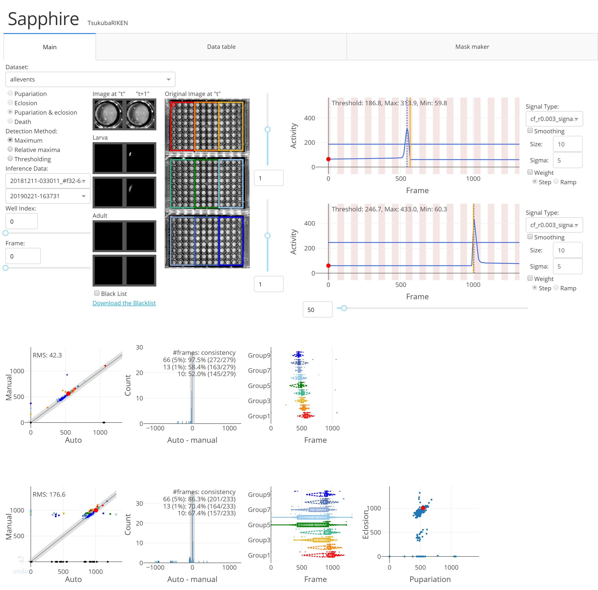

個体別活動量ビューア（Sapphire）
====

# Description
各個体の活動量が見られるウェブアプリケーションです。

# Requirements
- Python (3.6.2)
- Flask-Caching (1.4.0)
- dash (0.24.1)
- dash-auth (1.1.2)
- dash-core-components (0.27.1)
- dash-html-components (0.11.0)
- dash-renderer (0.13.0)
- numpy (1.14.3)
- Pillow (4.2.1)
- plotly (3.1.1)

# Usage
manual.pdf を参照してください。

# Install
以下のコマンドで任意のディレクトリに clone してください。  
`$ git clone git@github.com:kanglab/DiamondsOnDash.git`  
または任意のディレクトリに ZIP ファイルをダウンロードして解凍してください。

# Licence
とくになし
